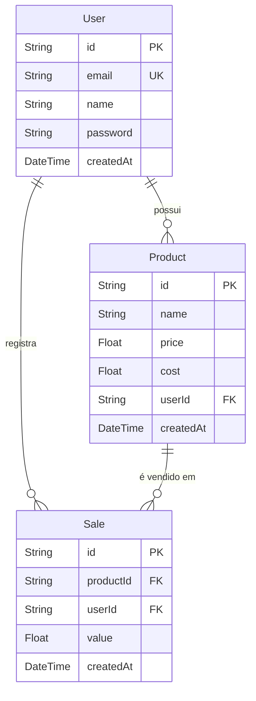
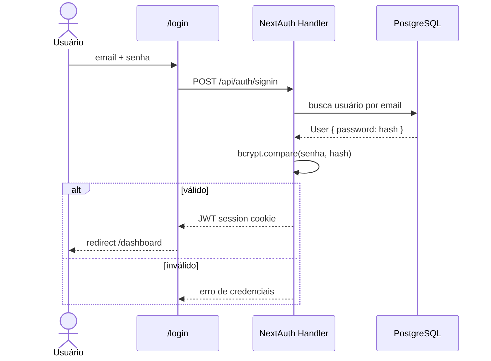

# README Redesign — Sistema de Gestão de Lanches

## Contexto

O README atual é o boilerplate padrão gerado pelo `create-next-app`. Não descreve o projeto, não instrui como rodar localmente, e não serve como referência técnica. Este documento especifica o conteúdo do README revisado, voltado exclusivamente para desenvolvedores.

**Objetivo:** Substituir o README padrão por um documento de referência técnica completo, com diagramas Mermaid, que permita a qualquer desenvolvedor entender e rodar o projeto em menos de 10 minutos.

**Idioma:** Português (pt-BR)  
**Audiência:** Desenvolvedores (colaboradores ou revisores do código)  
**Arquivo alvo:** `sistema-lanches/README.md`

---

## Seções e Conteúdo Esperado

### 1. Cabeçalho e Sobre o Projeto

- Título: `# Sistema de Gestão de Lanches`
- Badge de testes (opcional, se CI configurado futuramente)
- Parágrafo curto (3–4 linhas): contexto do problema (vendedor autônomo de lanches sem controle financeiro) e o que o Sprint 1 entrega (login → produtos → vendas com 1 toque → total do dia)

---

### 2. Tech Stack

Tabela com as tecnologias principais:

| Camada | Tecnologia |
|--------|-----------|
| Framework | Next.js 16 (App Router) |
| Linguagem | TypeScript |
| Estilização | Tailwind CSS |
| ORM | Prisma 7 |
| Banco de dados | PostgreSQL |
| Autenticação | NextAuth.js v4 (Credentials Provider) |
| Testes | Vitest + jsdom |

---

### 3. Pré-requisitos

Lista simples:
- Node.js >= 18
- Docker (para rodar o PostgreSQL localmente)
- npm >= 9

---

### 4. Setup Local

Passo a passo numerado:

1. Clonar o repositório
2. Instalar dependências: `npm install`
3. Criar `.env` a partir do `.env.example` (a ser criado) com as variáveis:
   - `DATABASE_URL`
   - `NEXTAUTH_SECRET`
   - `NEXTAUTH_URL`
4. Subir PostgreSQL via Docker:
   ```bash
   docker run --name lanches-db -e POSTGRES_PASSWORD=123456 -e POSTGRES_DB=lanches -p 5432:5432 -d postgres
   ```
5. Rodar migrations: `npx prisma migrate dev`
6. Iniciar servidor de desenvolvimento: `npm run dev`
7. Abrir `http://localhost:3000`

---

### 5. Arquitetura

**Diagrama Mermaid — Fluxo de requisição com middleware de autenticação:**

```mermaid
flowchart LR
    Browser -->|request| Middleware
    Middleware -->|autenticado| AppRouter
    Middleware -->|não autenticado| Login[/login]
    AppRouter --> Dashboard[/dashboard]
    AppRouter --> Products[/products]
    AppRouter --> API[API Routes]
    API --> Prisma
    Prisma --> PostgreSQL[(PostgreSQL)]
```

Descrição textual:
- Next.js App Router gerencia frontend e API no mesmo processo
- `src/middleware.ts` usa `withAuth` do NextAuth para proteger `/dashboard` e `/products`, redirecionando para `/login`
- API Routes em `src/app/api/` validam sessão via `getServerSession` antes de qualquer operação no banco
- O singleton do PrismaClient está em `src/lib/prisma.ts` usando o driver adapter `@prisma/adapter-pg`

---

### 6. Modelo de Dados

**Diagrama Mermaid — Entidade-Relacionamento:**



Nota importante: `Sale.value` armazena o preço no momento da venda — edições futuras no `Product.price` não afetam o histórico.

---

### 7. API Endpoints

Tabela completa:

| Método | Rota | Descrição | Auth |
|--------|------|-----------|------|
| GET/POST | `/api/auth/[...nextauth]` | Handler NextAuth (login, logout, session) | — |
| POST | `/api/register` | Cria conta de usuário | Não |
| GET | `/api/products` | Lista produtos do usuário autenticado | Sim |
| POST | `/api/products` | Cria produto (`name`, `price > 0`, `cost > 0`) | Sim |
| POST | `/api/sales` | Registra venda com snapshot do preço atual | Sim |
| GET | `/api/sales/today` | Vendas do dia + total em reais | Sim |

---

### 8. Autenticação

**Diagrama Mermaid — Fluxo de login:**



- Estratégia: JWT (sem sessão no banco)
- Proteção de rotas: `src/middleware.ts` com `withAuth({ pages: { signIn: '/login' } })`
- Rotas protegidas: `/dashboard`, `/products`

---

### 9. Estrutura de Pastas

```
sistema-lanches/
├── prisma/
│   └── schema.prisma          # Modelos: User, Product, Sale
├── src/
│   ├── app/
│   │   ├── (auth)/
│   │   │   ├── login/         # Página de login
│   │   │   └── register/      # Página de cadastro
│   │   ├── dashboard/
│   │   │   ├── page.tsx       # Botões de produto + total do dia
│   │   │   └── actions.ts     # Server Action: registerSale
│   │   ├── products/
│   │   │   ├── page.tsx       # Lista de produtos
│   │   │   └── new/page.tsx   # Formulário de criação
│   │   └── api/
│   │       ├── auth/[...nextauth]/route.ts
│   │       ├── products/route.ts
│   │       ├── register/route.ts
│   │       └── sales/
│   │           ├── route.ts
│   │           └── today/route.ts
│   ├── lib/
│   │   ├── prisma.ts          # Singleton PrismaClient
│   │   ├── auth.ts            # Config NextAuth
│   │   └── totals.ts          # calcularTotalDia() — função pura
│   ├── middleware.ts           # withAuth — proteção de rotas
│   └── __tests__/
│       ├── setup.ts            # Mock global do Prisma
│       ├── api/
│       │   ├── products.test.ts
│       │   └── sales.test.ts
│       └── lib/
│           └── totals.test.ts
└── docs/
    └── superpowers/
        ├── specs/             # Design docs de cada sprint
        └── plans/             # Planos de implementação
```

---

### 10. Testes

```bash
npm test           # roda todos os testes uma vez
npm run test:watch # modo watch
npx vitest run src/__tests__/lib/totals.test.ts  # arquivo específico
```

**Cobertura atual (Sprint 1):**

| Arquivo de teste | O que cobre |
|-----------------|-------------|
| `api/products.test.ts` | GET (filtro por usuário) e POST (validação + criação) |
| `api/sales.test.ts` | POST (snapshot de preço) e GET /today (filtro + soma) |
| `lib/totals.test.ts` | `calcularTotalDia()` — função pura, sem mock |

O Prisma é mockado globalmente via `src/__tests__/setup.ts`. Nenhum teste requer banco de dados real.

---

### 11. Roadmap

| Sprint | Status | Funcionalidades |
|--------|--------|----------------|
| Sprint 1 | ✅ Concluído | Login, cadastro, produtos, registro de vendas com 1 toque, total do dia |
| Sprint 2 | 🔜 Planejado | Controle de estoque, gestão de gastos, relatório de lucro diário/mensal, exportação PDF |

---

### 12. Deploy

1. **Banco de dados:** criar instância no [Neon](https://neon.tech) ou Vercel Postgres; copiar a `DATABASE_URL`
2. **App:** importar o repositório no [Vercel](https://vercel.com), configurar as variáveis de ambiente (`DATABASE_URL`, `NEXTAUTH_SECRET`, `NEXTAUTH_URL`) e fazer deploy

---

## Decisões de Design do Documento

- **CLAUDE.md não é duplicado:** detalhes de arquitetura profunda (convenções do Next.js 16, regras de `userId` em queries, etc.) ficam no CLAUDE.md, que é voltado para o agente de IA. O README cobre o suficiente para um desenvolvedor humano começar.
- **Diagramas Mermaid** em vez de imagens: renderizados diretamente no GitHub, sem necessidade de atualizar screenshots.
- **Setup local completo:** inclui o comando Docker para não presumir que o desenvolvedor já tem PostgreSQL instalado.
